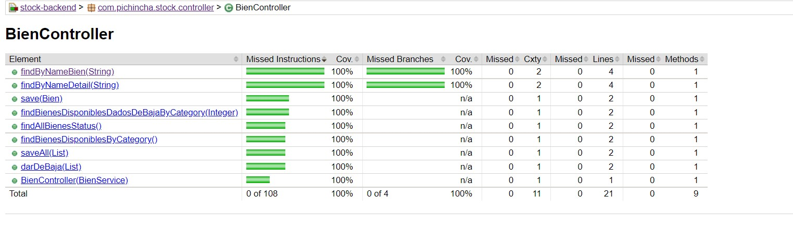

# Applicación Control de Inventarios

#### Solución al reto técnico para solventar el siguiente problema:

Hacer una pequena app SpringBoot la cual permite :

* Realizar el control de inventarios de una empresa (stock), los bienes de la empresa se dividen en 3 categorías, la
  aplicación debe permitir añadir nuevos bienes a una determinada categoría y también poder dar de baja a estos.
* Varios tipos de bienes pueden estar dentro de la misma categoría.
* Se debe llevar el histórico de movimiento de los bienes.
* Se debe idear la mejor manera de implementar la solución para este caso.

#### La aplicación debe exponer endPoints para:

* Crear y actualizar categorias.
* Crear un nuevo bien y asignarlo a una categoría.
* Recuperar el listado de bienes con el detalle de estos (activos, dados de baja).
* Recuperar cuantos bienes disponibles existe en cada categoría.
* Recuperar las categorías existentes con sus respectivos bienes.
* Dada una categoria, recuperar cuando bienes están disponibles y cuantos se han dado de baja.
* Ingresar un lote de nuevos bienes.
* Dar de baja un bien o lote de bienes.

#### Indicaciones:

* Las clases y atributos a crear son a criterio del candidato evaluado, únicamente colocar los atributos que considere
  mas importantes teniendo como máximo 5 atributos por clase.
* La informacion debe ser almacenada en una base de datos  (
  puede utilizar la bdd que desee).
* Realizar las pruebas (unitarias, integración) que considere necesarias.
* Aplicar las practicas, patrones, estándares, etc que considere.
* Para las pantallas frontEnd, debe hacer uso de los endpoints creados en la app springBoot.
* Subir el código (front/back) a un repositorio GIT.

## Frameworks utilizados

* [Gradle](https://docs.gradle.org) - Gestor de dependencias
* [Spring Data JPA](https://docs.spring.io/spring-boot/docs/2.5.5/reference/htmlsingle/#boot-features-jpa-and-spring-data)
  - Api de Persistencia
* [Spring MVC](https://spring.io/guides/gs/serving-web-content/)
* [Flyway](https://flywaydb.org/) - Manejo y Control de migraciones
* [PostgreSQL](https://www.postgresql.org/) - Base de datos SQL
* [Lombok](https://projectlombok.org/) - Framework para reducir código mediante anotaciones
* [Github](https://github.com/) - Repositorio
* [Postman](https://www.postman.com/) - Test de endpoints

## Librerias necesarias

Para levantar la aplicación se debe contar con las siguientes versiones:

* JDK o OpenJDK v11+
* PostgreSQL v12+
* Gradle 7.2
* VS Code - IntelliJ ó cualquier editor de texto que soporte código Java.

## Levantar base de datos PostgreSQL

### Con Docker

Para levantar la aplicación es necesario tener instalado docker en su SO, para mas información de como realizar la
instalación puede consultar acá:

* Windows: [Docker in Windows](https://docs.docker.com/desktop/windows/install/)
* Linux: [Docker in Linux](https://docs.docker.com/engine/install/ubuntu/)

```shell
$  docker run -p 5434:5432  --name postgres -e POSTGRES_PASSWORD=postgres -e  POSTGRES_DB=stock -d postgres:12-alpine
```

### Sin Docker

Para levantar la aplicacin es necesario tener instalado el sistema operativo:

* Windows: [Install PostgrSQL in Windows](https://www.postgresqltutorial.com/install-postgresql/)
*
Linux: [Install PostgrSQL in Linux](tion/idol/IDOL_12_0/MediaServer/Guides/html/English/Content/Getting_Started/Configure/_TRN_Set_up_PostgreSQL_Linux.htm)
* Puerto: [5432].
* Crear base de datos con el nombre: [stock].

### Endpoints

#### Categoria

* [GET](http://localhost:8080/categoria/all) (http://localhost:8080/categoria/all) - buscar todas las categorias sin
  bienes relacionados
* [GET](http://localhost:8080/categoria/all-detail) (http://localhost:8080/categoria/all) - buscar todas las categorias
  con bienes relacionados
* [GET](http://localhost:8080/categoria) (http://localhost:8080/categoria?name=nombre_categoria) - buscar una categoria
  por su nombre
* [POST](http://localhost:8080/categoria) (http://localhost:8080/categoria) - registrar una nueva categoria
* [PUT](http://localhost:8080/categoria/all) (http://localhost:8080/categoria/all) - actualizar una categoria

#### Bien

* [GET](http://localhost:8080/bien/all) (http://localhost:8080/bien/all-estado) - buscar todos los bienes con el detalle
  de su respectivo estado
* [GET](http://localhost:8080/bien?name=nombre_del_bien) (http://localhost:8080/bien?name=nombre_del_bien) - buscar un
  bien por nombre
* [GET](http://localhost:8080/bien/detail?id=id_bien) (http://localhost:8080/bien/detail?name=nombre_del_bien) - buscar
  un bien con su detalle por nombre
* [POST](http://localhost:8080/bien) (http://localhost:8080/bien) - registrar un nuevo bien asociado a una categoria
* [GET](http://localhost:8080/bien/disponibles) (http://localhost:8080/bien/disponibles) - buscar cuantos bienes
  disponibles existe en cada categoria
* [GET](http://localhost:8080/bien/disponibles-categoria) (http://localhost:8080/bien/disponibles-categoria?categoria=codigo_categoria)
  - buscar cuandos bienes disponibles y dados de baja hay en una categoria
* [POST](http://localhost:8080/bien/batch) (http://localhost:8080/bien/batch) - registrar un lote de bienes
* [PUT](http://localhost:8080/bien/withdrawal) (http://localhost:8080/bien/withdrawal) - dar de baja uno o varios bienes

### Coverage

Para poder ejecutar los test y verificar el coverage respectivo se debe ejecutar el comando:

```shell
> ./gradlew jacocoTestReport
```

Una vez generado el reporte se genera un informe en la ruta: /build/jacocoHtml/index.html

Ejemplo del reporte:

